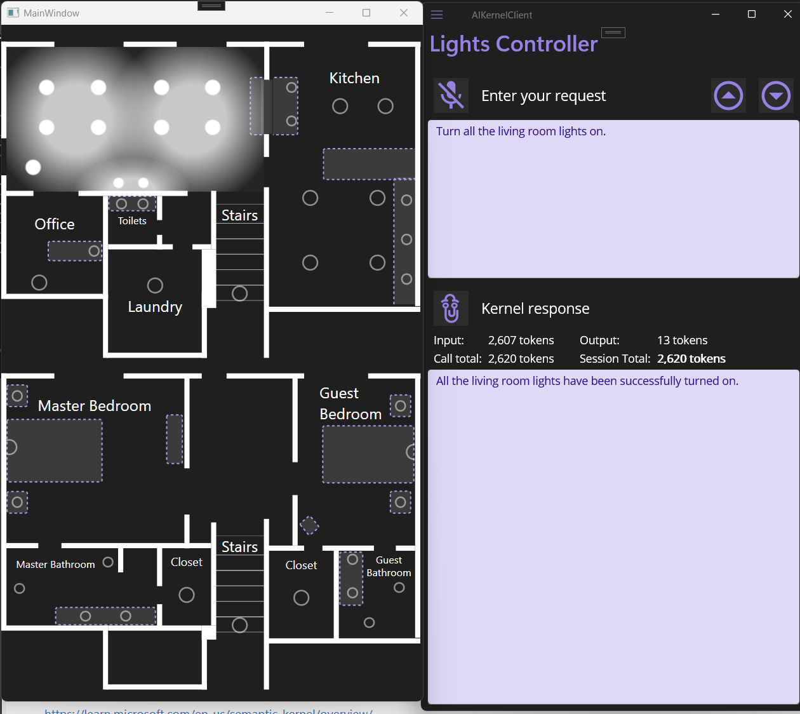
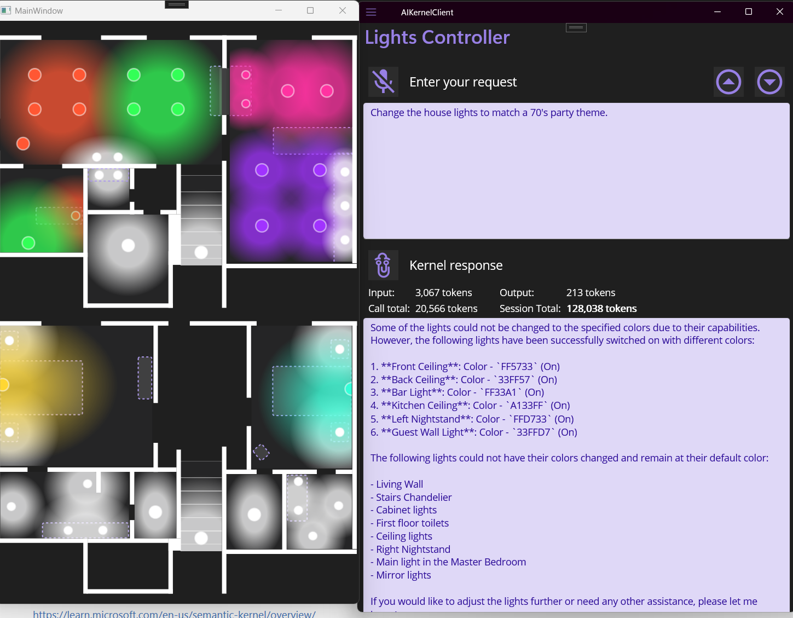
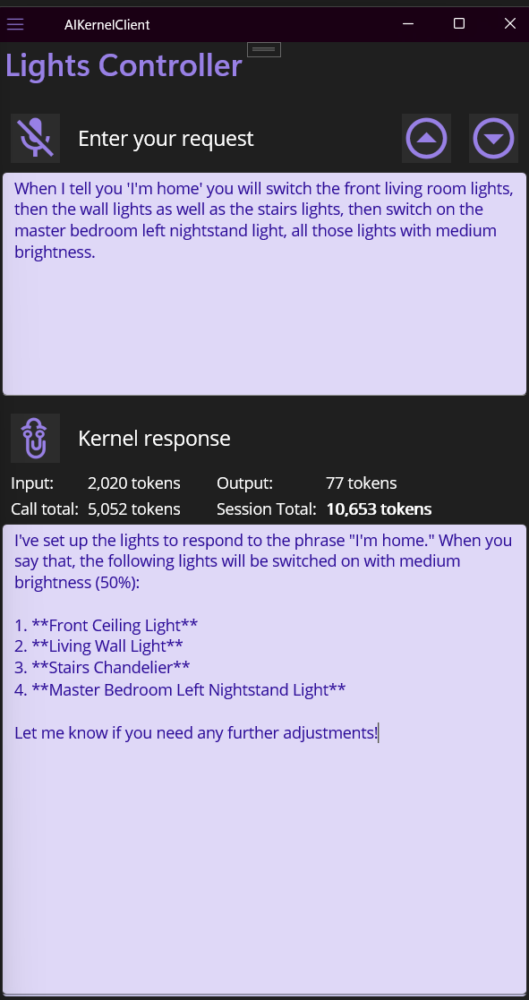
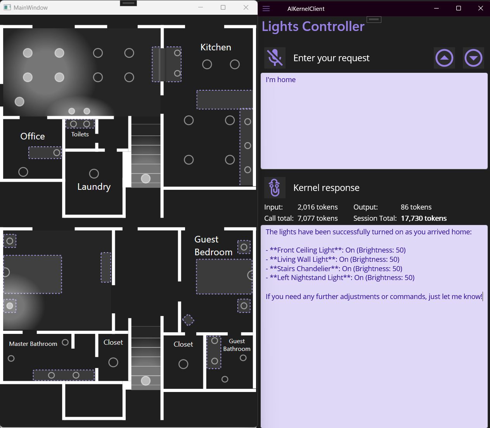
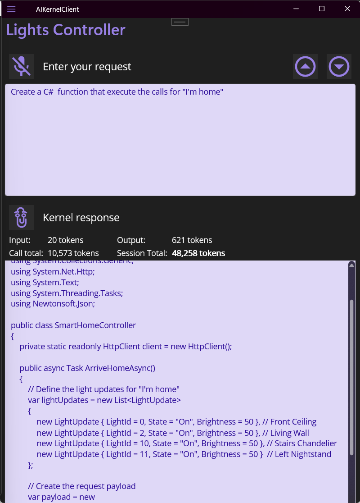

# AIKernelClient

## Overview
This project Shows how to **document a REST API using OpenAPI** so it is friendly and ready **to be understood and directly controlled by an AI model.**

In order to:
- Use domain language to execute commands directly on the API
- To create Domain related protocols
- To translate those protocols into Compliant code or scripting language that works.
## Goals
This project intent is to show best practices in documenting an API, its entities, the protocol usage (REST), using standards (OpenAPI).
In order to enable an AI to understand and communicate most precisely, accurately, with a user.
IMPORTANT: the AI will make decisions and will call directly functions on the service API. 
## Projects
The Solution is made of **4 C# .net 9.0 projects**
1. **LightControllerAPI:** The REST web service (Minimal API endpoints with OpenAPI generated definintion) **Is the service we want the AI to control** 

2. **AIKernelClient:** The controller application  **talking to the AI**: a cross platform **MAUI** (Multi platform) application that controls the service through prompts Using Semantic Kernel with a connector to OpenAI (Chat GPT 4o Mini) it relays service calls from the AI.
      - Plugin creation and propmting occurs in the class Services/**SemanticKernelService.cs** injected to the MainPageViewModel.cs
      - **SemanticKernelService.cs** will create the kernel, load the plugin, and will call the AI model with the prompt
      - **ApiKeyProvider.cs** will provide the OpenAI API key from secure storage or environment variable
      - **MainPageViewModel** will initialize the SemanticKernelService (**InitializeKernelAndPluginAsync**) and will call it to prompt the AI (**GetResponseAsync**)
      - Speech to Text is also implemented in the **MainPageViewModel.cs** class, by dependency injection.
3. **WPFPassiveClient:** A visualization application  that displays the changes done by the controler on the service by polling at regular intervals the changes made to the service resources (lights) (WPF application). 
4. **LightsAPICommon:** A shared Entities library  (with seeded data) is only shared with AIKernelClient for it contains prompts. None of the entities are used in the client

## References

- Semantic Kernel

    https://learn.microsoft.com/en-us/semantic-kernel/overview/

 - Maui Speech to Text

    https://learn.microsoft.com/en-us/dotnet/communitytoolkit/maui/essentials/speech-to-text?tabs=windows

   
   
   
   
   
   
## Features at Work

1. Remove the logic from the client application, allowing the AI to control the service directly.
1. Create a smart service that can be controlled by a client with autorization.
1. Use Semantic Kernel to create a plugin that allows the AI to interact with the service.
1. Have the prompts sent to the smart service and redirect the intents to the service.
1. Use memory storage to cache states per room/floor/light if needed.
1. 1. Use the Model Control Protocol (MCP) to enable the AI to control the service by sending intents and receiving actions.
2. Remove the logic from the client application, allowing the AI to control the service directly.
1. Use the Model Control Protocol (MCP) to enable the AI to control the service by sending intents and receiving actions.
 

- **MCP**: Enable the Model Control Protocol On the Server.
- **MCP**: Enable the Model Control Protocol On the Client.
- The client application (AIKernelClient) is designed to interact with the AI model, allowing it to send intents and receive actions that can be executed on the service.
- Let SK “think” in terms of intents → actions → API calls.
Adding the Model Control Protocol (MCP) to the server allows the AI to control the service directly by using intents, actions, and API calls.
- **Use MemoryStore** or vector memory to cache states per room/floor/light if needed.
