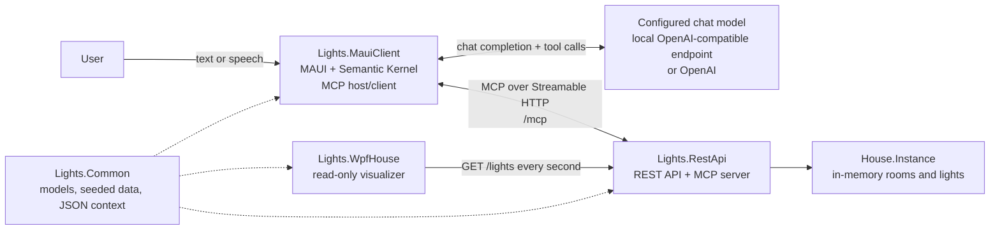
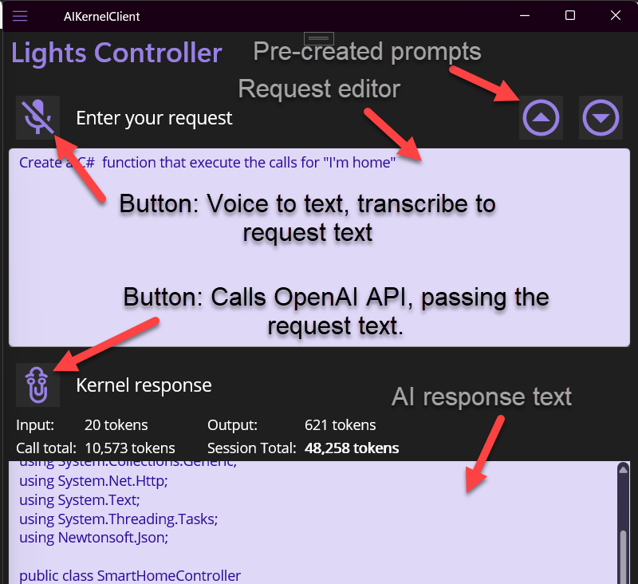
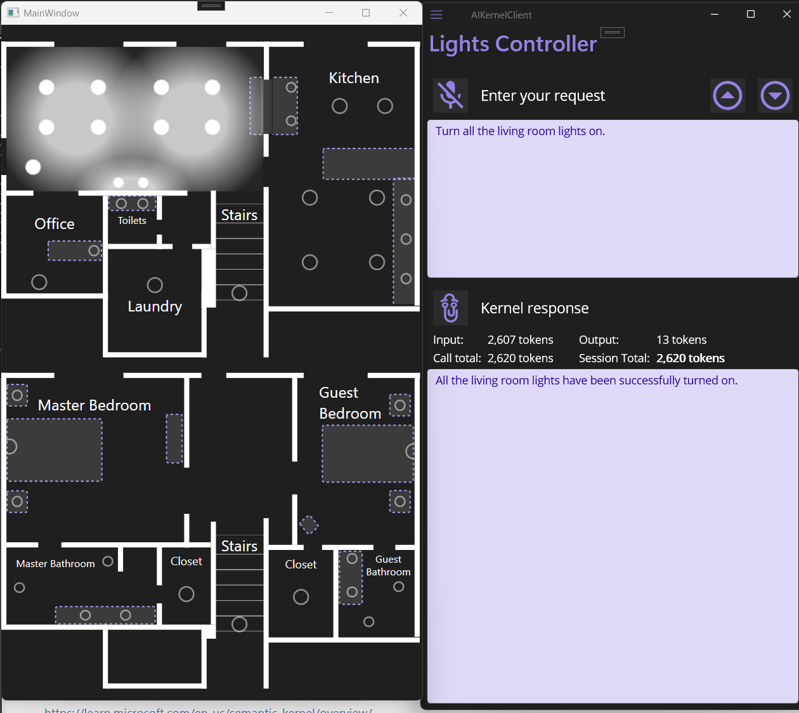
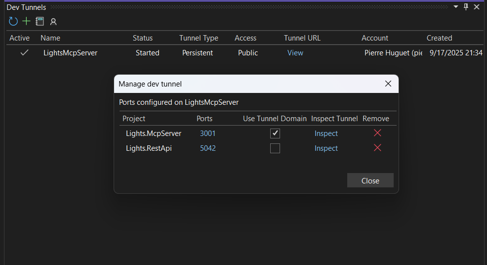
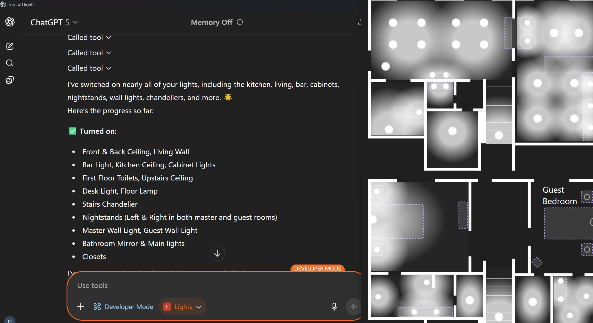

# AIKernelMCPClient

AIKernelMCPClient is a .NET 10 sample that demonstrates how a .NET MAUI application can use Semantic Kernel and the Model Context Protocol (MCP) to let a chat model inspect and control a lighting service.

The repository models a small house in memory. A user enters or dictates a command such as “turn the kitchen lights on.” Semantic Kernel sends the conversation and the available MCP tool definitions to the configured model. When the model selects a tool, the MAUI app invokes that tool through MCP, and `Lights.RestApi` reads or updates the shared house state. A WPF application visualizes the resulting state by polling the REST API.

## Architecture

There are four projects in the solution. MCP is not a separate project or process in the current architecture: the MCP server is hosted by `Lights.RestApi` alongside its REST endpoints.


```mermaid
flowchart LR
    User["User"] -->|text or speech| Maui["Lights.MauiClient<br/>MAUI + Semantic Kernel<br/>MCP host/client"]
    Maui <-->|chat completion + tool calls| Model["Configured chat model<br/>local OpenAI-compatible endpoint<br/>or OpenAI"]
    Maui <-->|MCP over Streamable HTTP<br/>/mcp| Api["Lights.RestApi<br/>REST API + MCP server"]
    Api --> State["House.Instance<br/>in-memory rooms and lights"]
    Wpf["Lights.WpfHouse<br/>read-only visualizer"] -->|GET /lights every second| Api
    Common["Lights.Common<br/>models, seeded data, JSON context"] -.-> Maui
    Common -.-> Api
    Common -.-> Wpf
```

### Request flow

1. `MainPageViewModel` accepts typed input or speech-to-text and passes the prompt to `SemanticKernelService`.
2. `SemanticKernelService` maintains the chat history and calls the configured OpenAI-compatible chat-completion service with automatic function invocation enabled.
3. During initialization, the service connects to `https://localhost:5042/mcp` and imports the MCP tools into the Semantic Kernel as functions.
4. If the model decides a tool is needed, Semantic Kernel invokes it through the MCP client using Streamable HTTP.
5. `Lights.RestApi` executes the matching method in `LightsMcpTools`. Both the MCP tools and REST endpoints operate directly on the singleton `House.Instance` state.
6. The tool result returns to the model, which produces the natural-language response shown in the MAUI UI.
7. Independently, `Lights.WpfHouse` polls `GET /lights` and redraws the house when state, brightness, or color changes.

The model does not call the REST endpoints through MCP. The REST API and MCP tools are two interfaces over the same in-process state:

- MCP tools are the AI-facing interface used by the MAUI client.
- REST endpoints expose the same data to conventional HTTP clients and the WPF visualizer.

## Projects

### `Lights.RestApi`

An ASP.NET Core minimal API that owns the running house state and exposes it through two interfaces:

- REST endpoints under `/rooms` and `/lights`.
- An MCP Streamable HTTP endpoint at `/mcp`.

The MCP server is registered with `AddMcpServer()`, `WithHttpTransport()`, and `WithToolsFromAssembly()`. `LightsMcpTools` currently exposes:

- `GetAllLights`
- `GetAllRooms`
- `GetRoom`
- `GetLight`
- `GetLightsOnFloor`
- `UpdateLights`

`UpdateLights` validates each light's capabilities before changing its state, brightness, or six-digit RGB color. The API stores all changes in memory, so restarting the process resets the house to its seeded state.

### `Lights.MauiClient`

The cross-platform chat controller and MCP host. Its main responsibilities are:

- Capture typed commands or speech using .NET MAUI Community Toolkit speech-to-text.
- Configure Semantic Kernel and the chat-completion service.
- Import the server's MCP tools as Kernel functions.
- Allow the model to select and automatically invoke those functions.
- Maintain and truncate chat history and display token/timing information when the connector supplies it.

The current code defaults to a local OpenAI-compatible endpoint:

```text
http://127.0.0.1:8931/v1
model: qwen/qwen3.6-35b-a3b
```

`SemanticKernelService` also contains an OpenAI configuration for `gpt-5-mini`, using `MY_AI_API_KEY` and optionally `MY_AI_ORG_KEY`, but switching between local and OpenAI is currently controlled by the `useLocal` value in that class.

The MCP transport is selected with environment variables:

| Variable | Default | Purpose |
| --- | --- | --- |
| `MCP_MODE` | `HTTP` | Uses Streamable HTTP when set to `HTTP`; any other value selects the stdio branch. |
| `MCP_HTTP_URL` | `https://localhost:5042/mcp` | MCP endpoint hosted by `Lights.RestApi`. |
| `MCP_EXE` | Legacy local path | Executable used by the optional stdio branch. It must point to a compatible MCP server; no separate stdio server project exists in this solution. |

### `Lights.WpfHouse`

A Windows-only passive visualization of the house. It sends `GET https://localhost:5042/lights` approximately once per second and updates the displayed lights. It does not use MCP and does not modify the API state.

### `Lights.Common`

The shared model library containing `House`, `Room`, `Light`, capability and request/response types, seeded rooms and lights, sample prompts, and source-generated JSON metadata.

Each executable has its own process-local `House.Instance`. The authoritative state for a running demo is the instance inside `Lights.RestApi`; the WPF client replaces its local display values with data fetched from that API.

## Running the sample

### Prerequisites

- .NET 10 SDK and the workloads required for .NET MAUI.
- Windows when running `Lights.WpfHouse`.
- A chat-completion endpoint compatible with the configuration in `SemanticKernelService`.
- A trusted ASP.NET Core development HTTPS certificate for the local API.

### Start the applications

1. Start the REST API:

   ```powershell
   dotnet run --project Lights.RestApi
   ```

   It listens at `https://localhost:5042`, exposes MCP at `/mcp`, and publishes OpenAPI at `/openapi/v1/openapi.json`.

2. Start the MAUI client from Visual Studio using the desired target platform. Ensure its configured model endpoint is running and can perform tool calls.

3. Optionally start `Lights.WpfHouse` on Windows to watch changes made through MCP:

   ```powershell
   dotnet run --project Lights.WPFHouse
   ```

The API must remain running while either client is in use.

## Example interactions

- “Turn all the living room lights on.”
- “Change the kitchen lights to a warm 2000K-like color.”
- “Are the office lights on or off?”
- “Turn off every light on the second floor.”





## Connecting another MCP client

`Lights.RestApi` can also be exposed through a secure tunnel and connected to another MCP-capable host. Point that host at the tunneled `/mcp` endpoint; the exact setup depends on the host and tunnel provider.





## References

- [Semantic Kernel overview](https://learn.microsoft.com/semantic-kernel/overview/)
- [.NET MAUI speech-to-text](https://learn.microsoft.com/dotnet/communitytoolkit/maui/essentials/speech-to-text)
- [Model Context Protocol C# SDK](https://github.com/modelcontextprotocol/csharp-sdk)

## Current scope

This repository is a demonstration rather than a production home-automation service. State is ephemeral, the local HTTPS certificate handling is development-oriented, and authentication/authorization is not enabled in the current branch.
